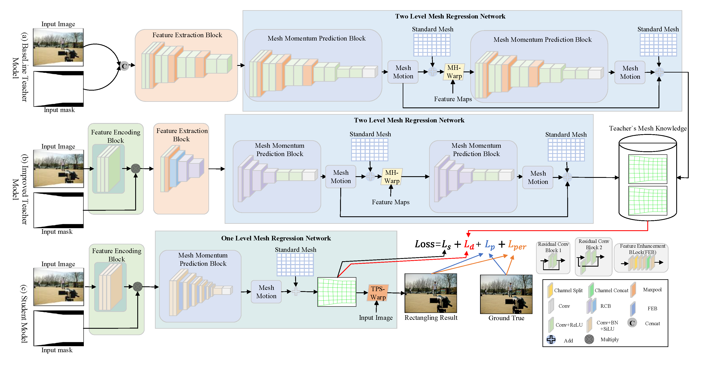

<h1 align = "center">Faster,Lighter,Stronger: Image Rectangling Using Multi-Teacher Instance-Level Distillation</h1>
<p align="center">Yuan Mei*, Lichun Yang', Mengsi Wang*, Yidan GAo`, Kaijun Wu*</p>
<p align="center">* the School of Electronic and Information Engineering, Lanzhou Jiaotong University</p>
<p align="center">' the Key Lab of Opt-Electronic Technology and Intelligent Control of Ministry of Education, Lanzhou Jiaotong University</p>
<p align="center">` the School of Software Engineering, Chongqing University of Posts and Telecommunications</p>


## Dataset (DIR-D)
We use the DIR-D dataset to train and evaluate our method. Please refer to [DeepRectangling](https://github.com/nie-lang/DeepRectangling?tab=readme-ov-file) for more details about this dataset.


## Code
#### Requirement
numpy==1.22.4

opencv_python==4.5.5.64

timm==0.9.6

torch==1.12.1+cu116

torchvision==0.13.1+cu116

tensorflow-gpu==2.10.0

## Training
The project is an image rectangling task. We construct an instance-level distillation strategy based on the a priori lattice knowledge base of Teacher Model 1 and Teacher Model 2 to guide the learning of student models. Among them, the specific training steps for the student model are as follows:

Please modify the following paths in the files "DeepRectangling_Teacher1(Initial)/Codes/constant.py" and "DeepRectangling_Teacher2(Improved)/Codes/constant.py" to match the dataset and project paths:

1."TRAIN_FOLDER": Update this variable to the path of your training dataset.

2."TEST_FOLDER": Update this variable to the path of your testing dataset.

3."SNAPSHOT_DIR": Update this variable to the directory where you want to save the trained models.

4."SUMMARY_DIR": Update this variable to the directory where you want to save the summary files.

### Step1: Preparing the pre-training weights for teacher model 1
Download the pre-training weight for teacher Model 1 and put them under the path "DeepRectangling_Teacher1(Initial)/Codes/checkpoints". Because we are based directly on DeepRectangling, we will not do any retraining here. The weight file can be found inside the [DeepRectangling](https://github.com/nie-lang/DeepRectangling?tab=readme-ov-file) project.


### Step2: Training Teacher 2 Model
Enter into the "DeepRectangling_Teacher2(Improved)/Codes" file directory.
```
python train.py
```

### Step3: Generating an offline mesh knowledges base based on Teacher 1 and Teacher 2
Run "teacher1_gen_mesh_knowledges.py" and "teacher2_gen_mesh_knowledges.py" under "DeepRectangling_Teacher1(Initial)/Codes/" and "DeepRectangling_Teacher2(Improved)/Codes/" respectively. " The purpose of this process is to generate the mesh knowledges and weights corresponding to the two teacher models (here we use the SSIM value of those models on the training data set as their weight metric).
```
python teacher1_gen_mesh_knowledges.py
```
```
python teacher2_gen_mesh_knowledges.py
```

### Step 4: Training Student Model
Enter into the "DeepRectangling_student" file directory. Modify the corresponding file path to the corresponding file path under your project. (eg: 'path', 'dis_mesh_path_TeacherImprove', 'dis_mesh_path_TeacherOR', 'dis_mesh_path_TeacherImprove_weight', 'dis_mesh_path_TeacherOR_weight')
```
python train.py
```

## Testing
Our pretrained teacher 2 model and student model can be available at [Google Drive](https://drive.google.com/file/d/1LFadsV1fg-DCT9IjiKbPlIaflUdHhNVl/view?usp=sharing). Addionally, the pretrained teacher 1 model and student model can be available at [Google Drive](https://drive.google.com/drive/folders/1gEsE-7QBPcbH-kfHqYYR67C-va7vztxO?usp=sharing).

### Testing student model
Enter into the "DeepRectangling_student" file directory.
```
python test.py
```

### Testing teacher 2 model
Enter into the "DeepRectangling_Teacher2(Improved)/Codes" file directory.
```
python inference.py
```


## Meta
If you have any questions about this project, please feel free to drop me an email.

Yuan Mei -- 2551161628@qq.com


